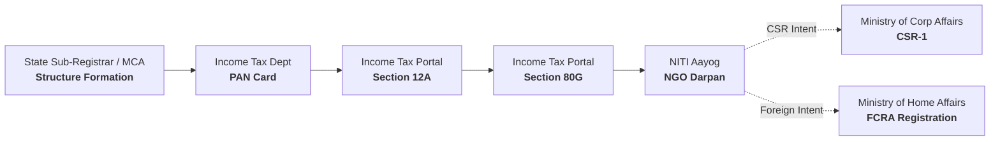
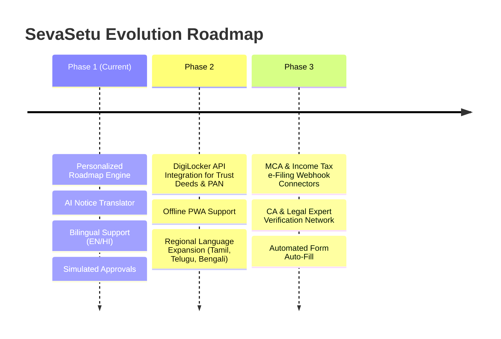

# 🇮🇳 SevaSetu (सेतुसेवा)
### *The Intelligent NGO Registration Copilot for India*

[](https://nextjs.org/)
[](https://react.dev/)
[](https://www.typescriptlang.org/)
[](https://tailwindcss.com/)
[](https://console.groq.com/)
[](#accessibility--inclusive-design)
[](#-bilingual-support-english--%E0%A4%B9%E0%A4%BF%E0%A4%A8%E0%A5%8D%E0%A4%A6%E0%A5%80)

> **Live Application**: [https://sevasetu.vercel.app](https://sevasetu.vercel.app)  
> *Built for the **Build What Moves India** Hackathon (Varun Mayya × OpenAI)*

---

## 📑 Table of Contents

- [The Problem](#-the-problem)
- [What SevaSetu Does](#-what-sevasetu-does)
- [Key Features](#-key-features)
  - [1. Dynamic Branching Roadmap Engine](#1-dynamic-branching-roadmap-engine)
  - [2. Interactive Guided Filing Modules](#2-interactive-guided-filing-modules)
  - [3. Real-Time Dashboard & Simulated Approvals](#3-real-time-dashboard--simulated-approvals)
  - [4. AI Notice Translator (Privacy-First)](#4-ai-notice-translator-privacy-first)
  - [5. Print & Export to One-Page Summary](#5-print--export-to-one-page-summary)
  - [6. Bilingual Support (English / हिन्दी)](#6-bilingual-support-english--हिन्दी)
- [Visual Design & Institutional Craft](#-visual-design--institutional-craft)
- [System Architecture & Registration Chain](#-system-architecture--registration-chain)
- [What is Real vs. What is Mocked](#-what-is-real-vs-what-is-mocked)
- [AI Engine & Privacy Guarantee](#-ai-engine--privacy-guarantee)
- [Getting Started & Local Development](#-getting-started--local-development)
- [Verification & Testing](#-verification--testing)
- [Judging Criteria Alignment](#-judging-criteria-alignment)
- [Future Scaling Roadmap](#-future-scaling-roadmap)
- [Mandatory Disclaimer](#-mandatory-disclaimer)

---

## 🚨 The Problem

Starting a non-profit organisation in India requires navigating **at least five disconnected government portals**, each run by different ministries with unique terminology, hidden prerequisite chains, and dense legal text:



### Why First-Time Founders Struggle:
1. **Hidden Dependencies**: You cannot apply for 80G without 12A; you cannot get Darpan without PAN; you cannot qualify for CSR-1 without Darpan.
2. **Legal Jargon**: Government guidelines are written in complex statutory legal prose that confuses grassroots changemakers.
3. **The FCRA Trap**: New non-profits often spend months trying to file for FCRA, unaware that standard approval typically requires a 3-year operating track record.
4. **Bureaucratic Notice Dread**: Receiving a clarification or scrutiny notice from the Income Tax department causes panic, often leading founders to pay thousands to predatory intermediaries.

---

## 🌉 What SevaSetu Does

**SevaSetu (सेतुसेवा)** acts as an intelligent, plain-language copilot for Indian NGO founders:

1. **Assesses Your Needs**: Takes 4 simple inputs (Org Name, Structure Status, Funding Plans, Org Age).
2. **Generates a Personalized Roadmap**: Computes the exact 5-to-7 step sequential registration chain tailored to your mission.
3. **Guides Every Step**: Provides step-by-step documentation checklists, realistic timelines, and actionable instructions.
4. **Demystifies Bureaucracy**: An AI-powered Notice Translator breaks down scary legal notices into **What it means**, **What to do next**, and **Deadlines**.

---

## ✨ Key Features

### 1. Dynamic Branching Roadmap Engine
- **Base 5 Registrations**: `Structure Registration` (Trust / Society / Section 8) $\rightarrow$ `Org PAN` $\rightarrow$ `12A Tax Exemption` $\rightarrow$ `80G Donor Exemption` $\rightarrow$ `NGO Darpan (NITI Aayog)`.
- **Conditional Branching**:
  - `CSR-1 (MCA)` is dynamically inserted if the organization plans to seek Corporate Social Responsibility funds.
  - `FCRA (MHA)` is dynamically appended if foreign funding is selected.
- **Radical Honesty Callouts**: If a new NGO (under 3 years old) selects foreign funding, SevaSetu does not silently present a dead end. It displays an explicit advisory callout explaining track-record realities and alternative mechanisms like *Prior Permission*.

### 2. Interactive Guided Filing Modules & Mock DigiLocker Integration
- Data-driven module template rendering all 7 Indian registration specifications.
- **Plain-English Explanations**: "What it is", "Why you need it", and "What happens after submitting".
- **Interactive Checklist**: Mock document upload verification system.
- **Interactive Mock DigiLocker Demo**: One-click "Pull from DigiLocker (Demo)" workflow demonstrating the future scaling vision with 1-click credential filling, verified certificate repository (Trust Deed, PAN, Aadhaar, NOC, Audit Statements), and instant checklist synchronization.
- **Strict Submission Gate**: "Submit for review" is disabled with contextual guidance until all required prerequisites are prepared.

### 3. Real-Time Dashboard & Simulated Approvals
- **Live Progress Tracking**: Numerical completion count, progress bar, and visual step indicators.
- **"Next Up" Highlighting**: Clear, uncluttered focus on the single active blocker.
- **Asynchronous Review Simulation**: Submitting a module transitions it to `Submitted`, which automatically advances to `Approved` after a ~15-second simulation timer.
- **One-Click Demo Persona Seeder**: Instantly seed a pre-populated NGO profile from the landing page to demonstrate a live approving workflow without manual form-filling.

### 4. AI Notice Translator (Privacy-First)
- Translates formal legal notices from government bodies into plain language.
- **Structured 3-Part Output**:
  1. 📌 **What this notice means**: 1–2 plain-language sentences summarizing the core issue.
  2. 🛠️ **What you need to do**: A concrete, action-oriented next step starting with a verb.
  3. ⏰ **By when**: The exact statutory deadline or a safe, urgent action recommendation.
- **Pre-Loaded Example Notice**: Included for instant, zero-latency testing during live presentations.
- **Cross-Language Consistency**: Translates English notices to plain English, and Hindi notices to plain Hindi.

### 5. Print & Export to One-Page Summary
- Integrated clean print stylesheet (`@media print`).
- Generates a formal, one-page document complete with Organization Name, Reference ID, Step Matrix, and Disclaimer to hand directly to Chartered Accountants (CAs), lawyers, or board members.

### 6. 🌐 Bilingual Support (English / हिन्दी)
- Full localization switch (`EN` / `हिं`) persisted across user sessions.
- Covers the entire user journey: Landing, Intake, Personalized Roadmap, all 7 Guided Modules, Dashboard, About page, and AI Notice Translator.

---

## 🎨 Visual Design & Institutional Craft

SevaSetu deliberately avoids generic startup landing page tropes (gradients, glassmorphism, floating cards) in favor of a restrained, high-contrast, GOV.UK-inspired **institutional aesthetic**:

```
┌────────────────────────────────────────────────────────────────────────┐
│ 🇮🇳 [Saffron / White / Green] Indian Tricolor Header Strip              │
├────────────────────────────────────────────────────────────────────────┤
│  SevaSetu (सेतुसेवा)      [Roadmap] [Dashboard] [Translator]  [EN|हिं] │
├────────────────────────────────────────────────────────────────────────┤
│  Prepared for: Afora Foundation  │  Ref: SS-2026-9281  │  Steps: 4/6   │
│                                                                        │
│        ╔═══╗           ╔═══╗           ╔═══╗           ╔═══╗           │
│    ════╬═══╬═══════════╬═══╬═══════════╬═══╬═══════════╬═══╬════       │
│        ║ 1 ║ [Done]    ║ 2 ║ [Done]    ║ 3 ║ [Next]    ║ 4 ║ [Pending] │
│        ╚═══╝           ╚═══╝           ╚═══╝           ╚═══╝           │
│                                                                        │
│  [ Step 3: 12A Registration — Tax Exemption ]                          │
└────────────────────────────────────────────────────────────────────────┘
```

### Design System Highlights:
- **Color Palette**:
  - `ink` (`#16211F`): Primary high-contrast typography.
  - `bridge` (`#14464D`): Deep teal primary brand color symbolizing the crossing bridge.
  - `paper` (`#F5F6F4`): Crisp, neutral non-glare background.
  - `mist` (`#DCE3E0`): Clean structural dividers and borders.
  - `marigold` (`#C1861F`): Focused accent color for the active next step.
- **Typography**: `IBM Plex Sans` for clear UI readability paired with `IBM Plex Mono` for reference IDs, status codes, and timestamps.
- **Signature Suspension Bridge SVG**: Custom, hand-drawn vector bridge (`BridgeProgress.tsx`) featuring tapered towers, suspension cables, vertical hangers, and dynamic pylon lighting.
- **Accessibility (WCAG AA)**: 4.5:1+ contrast ratio on all text, 44px+ tap targets, 16px inputs to prevent mobile viewport zoom, and status badges that never rely on color alone (always Icon + Text).

---

## 🏛️ System Architecture & Registration Chain

```
               [ User Input: Intake Questions ]
                              │
                              ▼
                 [ lib/roadmap.ts: Engine ]
                              │
       ┌──────────────────────┼──────────────────────┐
       ▼                      ▼                      ▼
 [ 5 Base Steps ]      [ + CSR-1 Step ]       [ + FCRA Step ]
 (Trust/PAN/12A/80G)    (If CSR funding)     (If Foreign funding)
                              │                      │
                              │            [ Age < 3 Yrs? ]
                              │             ├── YES ──► [ Honesty Callout ]
                              │             └── NO  ──► [ Standard Step ]
                              ▼
                 [ App State: ProfileContext ]
                              │
          ┌───────────────────┼───────────────────┐
          ▼                   ▼                   ▼
    /roadmap             /module/[id]        /dashboard
  (Linear Plan)       (Checklist & Submit)  (Status & Tracking)
                              │
                              ▼
                   [ Simulated Approvals ]
                 (~15s Async Auto-Advance)
```

### Registration Matrix:

| ID | Registration Name | Governing Authority | Primary Purpose | Prerequisite |
|:---|:---|:---|:---|:---|
| `structure` | **Structure Registration** | State Registrar / MCA | Gives the NGO legal identity (Trust, Society, Sec-8) | None (Step 1) |
| `pan` | **Entity PAN Card** | Income Tax Dept | Enables official bank account & tax filing | Structure |
| `12a` | **12A Registration** | Income Tax Dept | Exempts NGO's own income from corporate taxation | Structure + PAN |
| `80g` | **80G Registration** | Income Tax Dept | Provides 50% tax deduction to Indian donors | 12A |
| `darpan` | **NGO Darpan ID** | NITI Aayog | Unlocks access to Central/State grant schemes | Structure + PAN |
| `csr1` | **CSR-1 Registration** | Ministry of Corp Affairs | Qualifies NGO to receive corporate CSR grants | 12A + 80G + Darpan |
| `fcra` | **FCRA Registration** | Ministry of Home Affairs | Permits receipt of foreign donations | 3+ Years Operations + Darpan |

---

## 🔒 What is Real vs. What is Mocked

SevaSetu maintains total transparency about where the prototype ends and real-world systems begin:

| Component | Status | Details |
|:---|:---:|:---|
| **Roadmap Branching Logic** | 🟢 **Real** | Pure algorithmic logic evaluating funding goals, age, and entity type. |
| **Notice Translator** | 🟢 **Real** | Live server-side LLM inference with automated JSON fallback extraction. |
| **Privacy Pipeline** | 🟢 **Real** | No user data retention; API keys are never exposed client-side. |
| **Bilingual Localization** | 🟢 **Real** | Full English and Hindi dictionary integration. |
| **Print Output** | 🟢 **Real** | Dedicated CSS print media rules producing clean physical summaries. |
| **Document Uploads** | 🟡 *Mocked* | Checklists simulate uploads locally; no files are sent to servers. |
| **Government Portal Submissions** | 🟡 *Mocked* | No live connection to Income Tax, MCA, or Darpan portals. |
| **Approval Timeline** | 🟡 *Mocked* | Simulates review via a ~15-second timer for demonstration purposes. |

Every simulated touchpoint in the application is visibly labeled with a `[Mocked]` tag.

---

## 🤖 AI Engine & Privacy Guarantee

The Notice Translator (`app/api/translate/route.ts`) is **provider-agnostic** and runs server-side against any OpenAI-compatible API.

### Recommended Provider: Groq
- **Contractual Zero-Training**: Under Groq's Customer Data Processing terms, inference prompts and completions are **never used to train models** on free or paid tiers.
- **Zero Retention**: Inputs and outputs are not stored beyond immediate inference execution.
- **High-Resilience Fallback Chain**:
  1. `Primary Model` (`openai/gpt-oss-120b`) in Strict JSON Mode
  2. `Fallback Model` (`qwen/qwen3.6-27b`) in Strict JSON Mode
  3. `Primary Model` in Plain Text Mode + Regex JSON Extractor
  4. `Fallback Model` in Plain Text Mode + Regex JSON Extractor

*(See [`docs/ai-provider.md`](file:///c:/Users/User/Documents/GitHub/SevaSetu/docs/ai-provider.md) for full provider privacy analysis).*

---

## 🚀 Getting Started & Local Development

### Prerequisites
- **Node.js**: `v20.x` or higher
- **npm**: `v10.x` or higher

### 1. Clone the Repository
```bash
git clone https://github.com/aksh120/SevaSetu.git
cd SevaSetu
```

### 2. Install Dependencies
```bash
npm install
```

### 3. Configure Environment Variables
Create a `.env.local` file in the project root:
```bash
cp .env.example .env.local
```

Populate `.env.local` with your preferred provider (Groq recommended):
```env
OPENAI_BASE_URL=https://api.groq.com/openai/v1
OPENAI_MODEL=openai/gpt-oss-120b
OPENAI_FALLBACK_MODEL=qwen/qwen3.6-27b
OPENAI_API_KEY=gsk_your_groq_api_key_here
```

*(Note: The app runs completely offline for roadmap and dashboard flows even without an API key; the key is only needed for live AI notice translations).*

### 4. Run Development Server
```bash
npm run dev
```
Open [http://localhost:3000](http://localhost:3000) in your browser.

---

## 🧪 Verification & Testing

SevaSetu includes built-in verification scripts to test core logic and user flows:

```bash
# Verify the 5 core branching roadmap scenarios and honesty callouts
npm run verify:roadmap

# Verify profile progress calculations, checklist states, and approval transitions
npm run verify:progress

# Run ESLint validation
npm run lint

# Build production bundle
npm run build
```

---

## 🏆 Judging Criteria Alignment

| Criteria | How SevaSetu Delivers |
|:---|:---|
| **Problem is Real** | Millions of grassroots non-profits in India remain unregistered or non-compliant due to fragmented portals and confusing legal language. |
| **Main Journey Works** | Complete end-to-end user flow: Intake questionnaire $\rightarrow$ Custom roadmap $\rightarrow$ Guided module checklist $\rightarrow$ Submission $\rightarrow$ Live dashboard tracking. |
| **Simpler & Accessible** | Plain-English explanations, full Hindi toggle, WCAG AA compliant contrast, 44px+ tap targets, Slow-3G optimization. |
| **Product Thinking** | Dependency engine prevents out-of-order filing; FCRA honesty callout prevents founders from wasting years on unattainable registrations. |
| **End-to-End Viability** | Real server-side LLM notice translation with zero-training privacy guarantees; clean print export for offline CA consultations. |
| **Honesty & Transparency** | Prominent `[Mocked]` badges on simulated government interactions; explicit disclaimer in the footer of every page. |

---

## 🔮 Future Scaling Roadmap



1. **DigiLocker Integration**: Enable founders to automatically pull verified trustee Aadhaar, PAN, and address proofs directly into checklists.
2. **Direct Portal Auto-Fill**: Generate pre-filled XML/JSON application schemas ready for direct upload to MCA, IT e-filing, and Darpan.
3. **Vernacular Expansion**: Add support for 8 additional Indian languages (Marathi, Gujarati, Tamil, Telugu, Kannada, Bengali, Odia, Malayalam).
4. **Verified CA Network**: One-click sharing of generated roadmaps with verified pro-bono Chartered Accountants for final filing review.

---

## ⚖️ Mandatory Disclaimer

> **Independent Hackathon Prototype**: SevaSetu is an independent educational prototype developed for the *Build What Moves India* hackathon. It is **not** an official government product and is **not** affiliated with, endorsed by, or connected to NITI Aayog, the Ministry of Corporate Affairs, the Income Tax Department, the Ministry of Home Affairs, or any other government body. No real government databases are accessed, and no personal identifiable information (PII) is stored.

---

<div align="center">
  <sub>Built with ❤️ for Indian Changemakers & Non-Profit Founders</sub>
</div>
